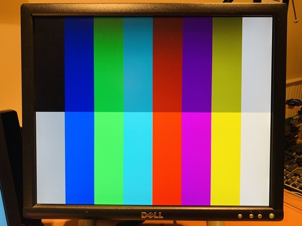
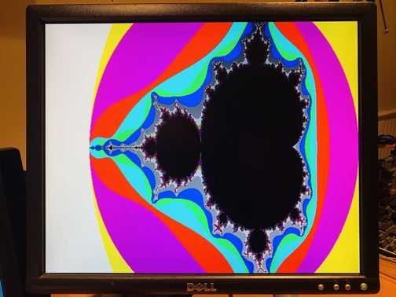

# 8-bit per-pixel color depth

When setting up the frame buffer using [mailbox property calls](https://github.com/raspberrypi/firmware/wiki/Mailbox-property-interface), you have an option to set the color depth. Color depth is managed with the Get depth (0x00040005), Test depth (0x00044005) and Set depth (0x00048005) property tags.  
You will find many examples where this property tag is typically set to 16 or 32. Vary rarely, if at all, is it set to 8. A value of 8 sets a color depth of 8-bits (1 Byte) per pixel, which translates to 256 colors per pixel. In this mode each pixel is controlled by 1 Byte, which also makes it asier to manipulate pixels if a simper color scheme is sufficient.  
It is not sufficient to set the color depth to 8 and then start writing bytes into frame buffer pixel locations. A pixel byte's value of 0 to 255 is actually a reference into a 256-slot palette that holds 256 32-bit BGR color settings. The palette is managed by the Get palette (0x0004000b), Test palette (0x0004400b) and Set palette (0x0004800b) property tags.  
This page explains how to create a palette and load it into the VideCore, and then use it with the 8-bit per pixel mode.

## Setup steps to use 8-bit per pixel color depth

1. Setup a mailbox property tag list for managing the frame buffer. Include:
  - [Allocate buffer](https://github.com/raspberrypi/firmware/wiki/Mailbox-property-interface#allocate-buffer) (0x00040001) tag
  - Set physical and virtual screen size tags
  - [Set depth](https://github.com/raspberrypi/firmware/wiki/Mailbox-property-interface#set-depth) (0x00048005) tag with a value of 8 for 8 bits per pixel
  - [Set palette](https://github.com/raspberrypi/firmware/wiki/Mailbox-property-interface#set-palette) (0x0004800b) tag with the appropriate palette information as described below.
2. Submit the request to Mailbox-0 at channel-8
3. Monitor for a response and check that the requests were all successful (follow the links above to see how that is done).
4. Assuming the buffer allocation was successful, use the returned frame buffer address to write the pixel colors as one byte per pixel.

> If you issue some Get_* requests for pitch and buffer size, you will notice that they match your requested resolution; pitch will match screen width, and buffer size in bytes will match screen width x height.

## Implementation steps

Reference the [sample code](../samples/fb.c) that loads a [16 color web-safe](https://en.wikipedia.org/wiki/Web_colors#HTML_color_names) palette and draws a [Mandelbrot set](https://en.wikipedia.org/wiki/Mandelbrot_set) fractal.  

Start with defining the palette in an array with 16 entries, 0 to 15, that correspond with pixel byte codes of 0 to 15. The example here only shows 15 colors, but this can easily be expanded to 256. Note that the pallet is in BGR bit order. The Set pixel order (0x00048006) tag does not seem to influence the palette order.  

```
uint32_t cga_palette_bgr[] =
{
    0x00000000,
    0x00800000,
    0x00008000,
    0x00808000,
    0x00000080,
    0x00800080,
    0x00008080,
    0x00C0C0C0,
    0x00808080,
    0x00FF0000,
    0x0000FF00,
    0x00FFFF00,
    0x000000FF,
    0x00FF00FF,
    0x0000FFFF,
    0x00FFFFFF
};
```



Next, assemble the mailbox message with your choice of tool/API. I use an API that is based on Part 5 of Brian Sidebotham's [RPi bare-metal tutorial](https://github.com/BrianSidebotham/arm-tutorial-rpi).  

```
bcm2835_mailbox_init();
bcm2835_mailbox_add_tag(TAG_FB_ALLOCATE, 4);
bcm2835_mailbox_add_tag(TAG_FB_SET_PHYS_DISPLAY, DISP_WIDTH, DISP_HEIGHT);
bcm2835_mailbox_add_tag(TAG_FB_SET_VIRT_DISPLAY, DISP_WIDTH, DISP_HEIGHT);
bcm2835_mailbox_add_tag(TAG_FB_SET_DEPTH, 8);

/* This is the Set pallet tag:
 *  0 offset, so start at the first location corresponding to pixel color byte 0x00
 *  16 BGR color entries
 *  a pointer to the static array of colors
 */
bcm2835_mailbox_add_tag(TAG_FB_SET_PALETTE, 0, 16, (uint32_t)cga_palette_bgr);

bcm2835_mailbox_add_tag(TAG_FB_GET_PITCH);
bcm2835_mailbox_add_tag(TAG_FB_GET_PALETTE);

if ( !bcm2835_mailbox_process() )
    halt("Mailbox call failed.");
```

The code snippet that sets up the palette tag in the mailbox message buffer looks like this:  

```
case TAG_FB_SET_PALETTE:
    offset = va_arg(vl, uint32_t);                      // The offset into the pallet list, 0
    length = va_arg(vl, uint32_t);                      // Number of color entries to load, 16
    if ( (offset > 255) || (length > (256 - offset)) )  // Just a range check for sanity
    {
        property_index--;                               // Remove the tab that was added earlier
        break;                                          //  and abort.
    }
    palette = (uint32_t*)va_arg(vl, uint32_t);          // Pointer to color information BGR array
    pt[property_index++] = 4*(2 + length);              // Tag length in bytes
    pt[property_index++] = MB_REQUEST;                  // A request ...
    pt[property_index++] = offset;                      // Palette 'offset' tag parameter
    pt[property_index++] = length;                      // Palette 'length' tag parameter
    for (i = 0; i < length; i++)
        pt[property_index++] = palette[i];              // Copy color info into the maibox buffer
    break;
```

That's it!  



